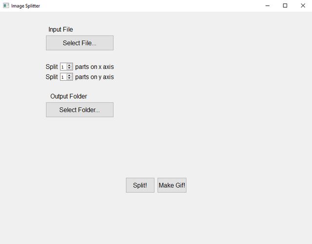

# Image Splitter
Image splitter for sprite animations.

Let's say we have an image like this:

We've to split them equally to make animation.
This python script does that.

Here's example outputs:

You can get gif output too!

In app screenshots:

